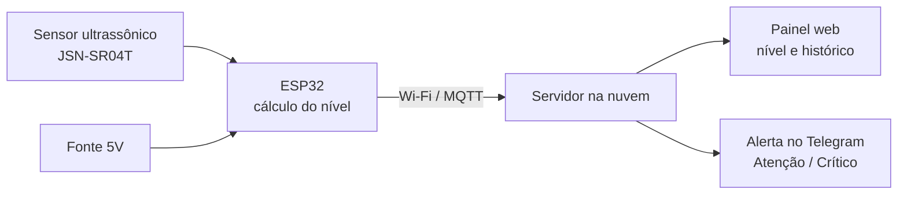

# DrainWatch

**Relatório de Acompanhamento e Status de Projeto (Semestral)**

- **Curso / Disciplina:** Engenharia de Software / Conectividade de Sistemas Ciberfísicos
- **Docente Orientador:** Prof. Fábio Bettio
- **Período Letivo:** 2026/02

---

## 1. Dados de Identificação do Projeto

- **Título do Projeto:** Sistema IoT de Monitoramento do Nível da Água em Bueiros para Prevenção de Alagamentos
- **Nome Curto:** DrainWatch
- **Área Temática:** Internet das Coisas (IoT) e Sistemas Embarcados
- **Repositório:** [cole aqui o link deste repositório]

### 1.1. Equipe e Divisão de Responsabilidades

| Matrícula | Nome Completo | Usuário GitHub | Função Principal | Responsabilidades |
| --- | --- | --- | --- | --- |
| [matrícula] | [nome] | @[usuário] | Líder de Hardware e Prototipagem | Escolha dos componentes, montagem do circuito e instalação do sensor |
| [matrícula] | [nome] | @[usuário] | Desenvolvedor(a) de Firmware e Software | Programação do ESP32, leitura do sensor, envio dos dados e alertas |
| [matrícula] | [nome] | @[usuário] | Modelagem 3D e Estrutura | Caixa protetora à prova d'água e suporte de fixação no bueiro |
| [matrícula] | [nome] | @[usuário] | Qualidade e Documentação | Cronograma, testes, validação e relatório |

---

## 2. Contextualização: Problema e Proposta de Valor

### 2.1. Formulação do Problema

Alagamentos urbanos são um problema frequente nas cidades brasileiras, principalmente em períodos de chuva intensa. Um dos principais motivos é o entupimento e a sobrecarga dos bueiros e galerias pluviais, que deixam de escoar a água e fazem ruas, casas e comércios alagarem em poucos minutos.

Hoje, na maioria das cidades, não existe um acompanhamento em tempo real do nível da água dentro dos bueiros. A prefeitura e a Defesa Civil geralmente só descobrem o problema quando a rua já está alagada, a partir de reclamações da população. O Cemaden monitora chuvas com pluviômetros em mais de 1.295 municípios, mas esse monitoramento mede a chuva que cai, e não o que acontece dentro do sistema de drenagem de cada rua.

Resolver esse problema é relevante porque os alagamentos causam prejuízos materiais, interrompem o trânsito, espalham doenças e colocam vidas em risco. Um aviso com alguns minutos de antecedência permite interditar ruas, avisar moradores e acionar equipes de limpeza antes do pior acontecer.

### 2.2. Solução Proposta

O DrainWatch é um dispositivo de baixo custo instalado dentro do bueiro, que mede continuamente a distância até a superfície da água usando um sensor ultrassônico à prova d'água. Um microcontrolador ESP32 calcula o nível da água e envia os dados pela internet (Wi-Fi) para um painel online.

O sistema classifica o nível em três faixas: **Normal**, **Atenção** e **Crítico**. Quando o nível passa para Atenção ou Crítico, ou quando sobe rápido demais, o sistema envia um alerta automático (por exemplo, pelo Telegram) para os responsáveis. O painel mostra o nível atual e o histórico das últimas horas.

**Escopo deste semestre:** um protótipo funcional com um sensor, testado em bancada simulando um bueiro (por exemplo, um balde ou tubo com água), com painel de visualização e envio de alertas. A instalação real em via pública, a rede com vários bueiros e a alimentação por energia solar ficam como trabalhos futuros.

---

## 3. Arquitetura e Esboço Técnico

**Figura 1:** Esboço da arquitetura do DrainWatch.

**Descrição do diagrama:** O sensor ultrassônico, instalado na tampa do bueiro, mede a distância até a água e envia a leitura ao ESP32. O ESP32 converte essa distância em nível da água, compara com os limites definidos e envia os dados via Wi-Fi, usando o protocolo MQTT, para um servidor na nuvem. O servidor guarda as leituras, exibe tudo em um painel web e dispara alertas no Telegram quando o nível entra nas faixas de Atenção ou Crítico. Uma fonte de 5V alimenta o circuito.

---

## 4. Estado da Arte e Referências

| # | Título | Autor / Ano | Link | O que aprendemos e o nosso diferencial |
| --- | --- | --- | --- | --- |
| 1 | Designing Early Warning Flood Detection and Monitoring System via IoT | IOP Conference Series: Earth and Environmental Science, 2020 | [Link](https://iopscience.iop.org/article/10.1088/1755-1315/479/1/012016) | Mede o nível da água em um canal de drenagem com sensor ultrassônico e usa três níveis de alerta (seguro, atenção e crítico). Adotamos essa classificação; nosso diferencial é o foco em bueiros urbanos e o alerta por velocidade de subida da água. |
| 2 | Water Level Monitoring and Flood Early Warning Using Microcontroller With IoT Based Ultrasonic Sensor | [conferir autor], Academia.edu | [Link](https://www.academia.edu/72599522/Water_Level_Monitoring_and_Flood_Early_Warning_Using_Microcontroller_With_IoT_Based_Ultrasonic_Sensor) | Usa NodeMCU ESP8266, ThingSpeak e alertas no Telegram, com erro médio de cerca de 1 cm. Mostrou que a combinação é viável e barata; usamos ESP32 e um sensor à prova d'água, mais adequado à umidade do bueiro. |
| 3 | Development of a smart sensing unit for LoRaWAN-based IoT flood monitoring and warning system in catchment areas | [conferir autor], ScienceDirect, 2023 | [Link](https://www.sciencedirect.com/science/article/pii/S2667345223000263) | Usa LoRaWAN para cobrir áreas grandes com baixo consumo de energia. Neste semestre usamos Wi-Fi pela simplicidade, mas o artigo aponta o caminho para uma rede com muitos bueiros no futuro. |
| 4 | Pluviômetros Automáticos (Rede de Monitoramento do Cemaden) | Cemaden / MCTI | [Link](http://www2.cemaden.gov.br/pluviometros-automatico/) | Referência brasileira de monitoramento em tempo real para alertas de desastres. O Cemaden mede a chuva; o DrainWatch mede o efeito dela dentro da drenagem de cada rua, complementando esse monitoramento. |
| 5 | Computer Vision and IoT-Based Sensors in Flood Monitoring and Mapping: A Systematic Review | [conferir autor e ano], PMC | [Link](https://www.ncbi.nlm.nih.gov/pmc/articles/PMC6891459/) | Revisão que compara técnicas de visão computacional e sensores IoT para monitorar enchentes. Ajudou a justificar a escolha do sensor ultrassônico, mais barato e simples que câmeras para um protótipo. |

---

## 5. Cronograma do Semestre e Status das Entregas

| Etapa | Prazo | Entregas | Responsável | Status |
| --- | --- | --- | --- | --- |
| M1: Definição e Pesquisa | Mês 1 | Escopo definido, requisitos e referências | Guilherme e Matheus | Concluído |
| M2: Arquitetura e Lista de Materiais | Mês 2 | Diagrama de blocos, esquema do circuito e lista de compras | Guilherme e Matheus | Em andamento |
| M3: Protótipo Alpha | Mês 3 | Testes do sensor ultrassônico e do envio de dados pelo ESP32 | [nome] | Não iniciado |
| M4: Integração | Mês 4 | Circuito, caixa protetora, painel e alertas funcionando juntos | Equipe | Não iniciado |
| M5: Validação e Banca Final | Mês 5 | Protótipo testado em bueiro simulado e relatório final | Equipe | Não iniciado |

---

## 6. Lista de Materiais e Custos

*Valores estimados. Atualizar com o preço real e o link de compra de cada item.*

| Item | Descrição | Qtd. | Preço Unit. (R$) | Total (R$) | Data de Aquisição | Link | Situação |
| --- | --- | --- | --- | --- | --- | --- | --- |
| 01 | Microcontrolador ESP32 DevKit | 1 | 40,00 | 40,00 | [data] | [link] | Pendente |
| 02 | Sensor ultrassônico à prova d'água JSN-SR04T | 1 | 45,00 | 45,00 | [data] | [link] | Pendente |
| 03 | Fonte 5V 2A | 1 | 20,00 | 20,00 | [data] | [link] | Pendente |
| 04 | Protoboard e jumpers | 1 | 20,00 | 20,00 | [data] | [link] | Pendente |
| 05 | Caixa de passagem hermética (IP65) | 1 | 25,00 | 25,00 | [data] | [link] | Pendente |
| 06 | LED e buzzer para alerta local | 1 | 10,00 | 10,00 | [data] | [link] | Pendente |

### 6.1. Resumo de Investimento

- **Custo desembolsado pela equipe:** R$ [valor]
- **Valor dos materiais que já tínhamos:** R$ [valor]
- **Custo total estimado:** R$ 160,00

---

## 7. Riscos e Desafios Técnicos

| Desafio | Impacto | Causa | Plano de Ação |
| --- | --- | --- | --- |
| Umidade e contato com água danificando o circuito | Alto | O bueiro é úmido e pode encher totalmente | Usar sensor à prova d'água e deixar o ESP32 em caixa hermética fora da área de alagamento |
| Leituras falsas do sensor | Médio | Lixo, folhas, espuma ou reflexos nas paredes do bueiro | Fazer a média de várias leituras e descartar valores fora do normal |
| Falta de sinal Wi-Fi no local | Médio | Bueiros ficam na rua, longe de roteadores | Guardar as leituras na memória e reenviar quando a conexão voltar; estudar LoRa ou rede móvel no futuro |
| Falta de energia durante tempestades | Alto | Quedas de energia são comuns em chuvas fortes | Prever bateria de reserva ou painel solar como melhoria futura |
